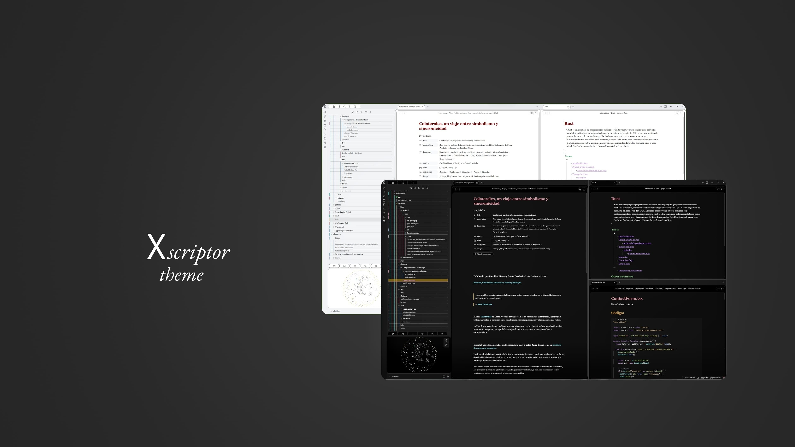
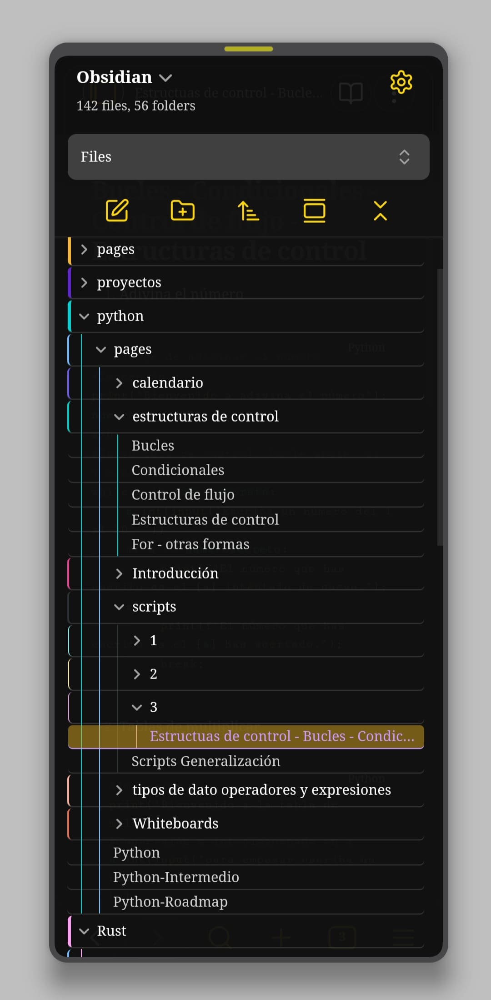
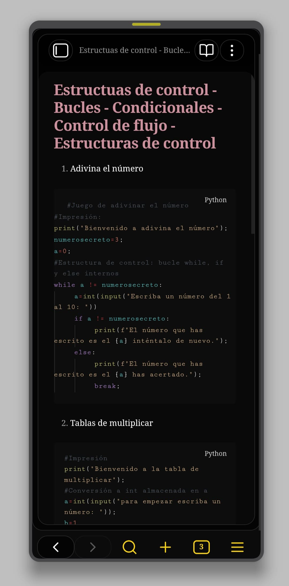
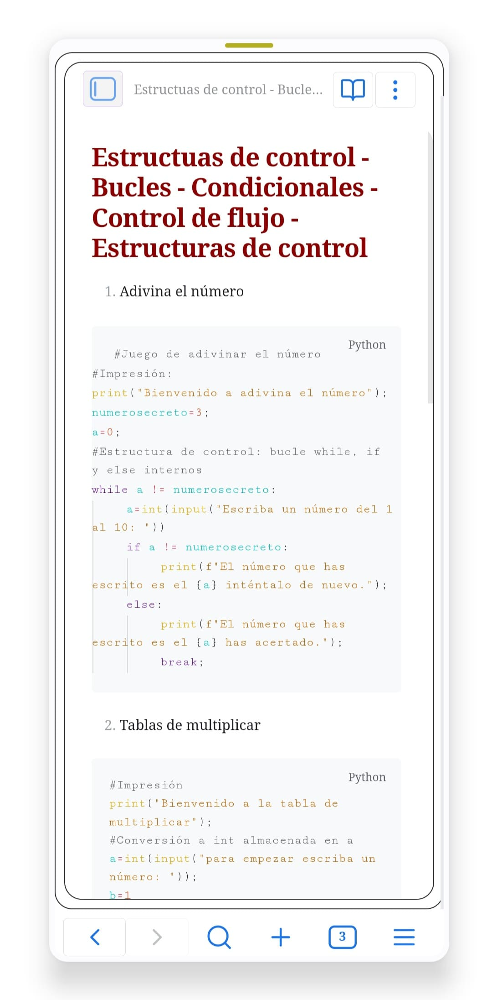
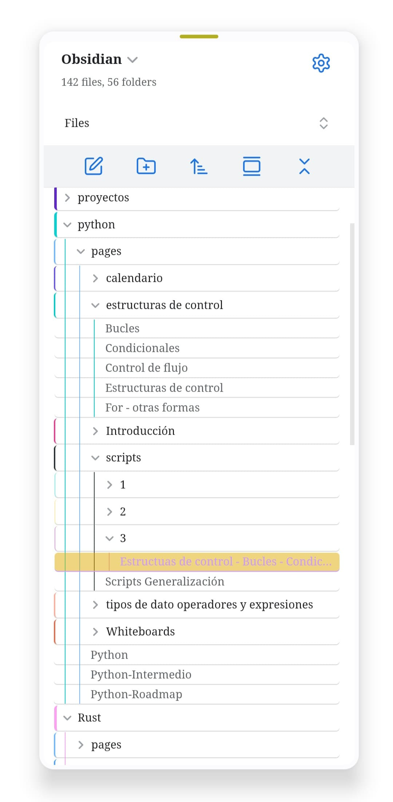
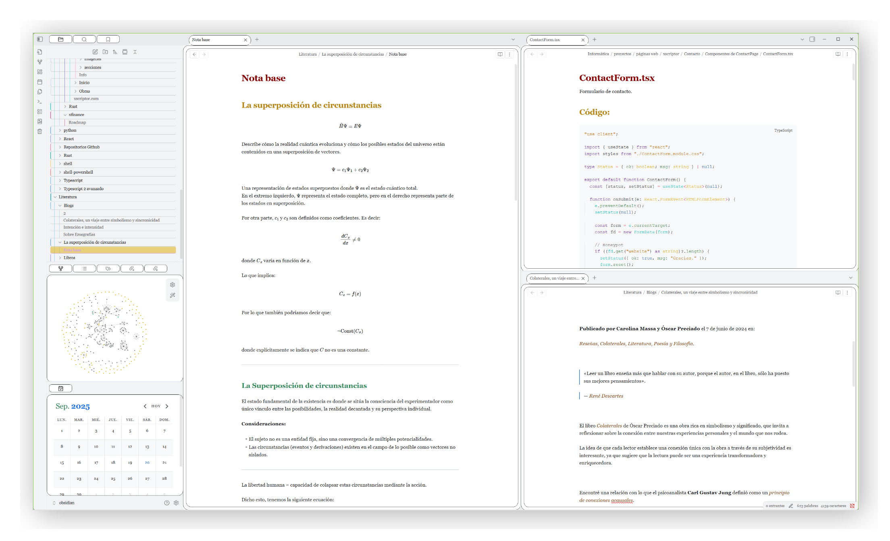
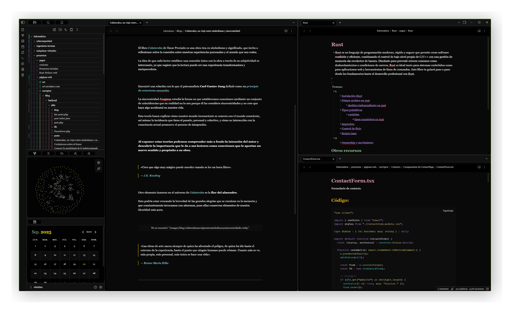

# Xscriptor

An elegant Obsidian theme for coders and writers with beautiful EB Garamond typography and flexible customization.

## Features
- Elegant EB Garamond typography
- Light & dark color palettes
- Subtle transparency and frosted-glass effects
- Enhanced code block readability
- Style Settings integration for customization

## Installation
- From Obsidian: Settings → Appearance → Community Themes → Search **Xscriptor Theme**
- Or manually: copy the `files` into `.obsidian/themes/Xscriptor Theme/` and select it in Settings → Appearance

## Previews
- Mobile

  
  
  
  

- Desktop

  
  

## License
[MIT License](LICENSE.md)

**Created by [Xscriptor](https://xscriptor.com)** · [Report Issues](https://github.com/xscriptordev/obsidian/issues)
